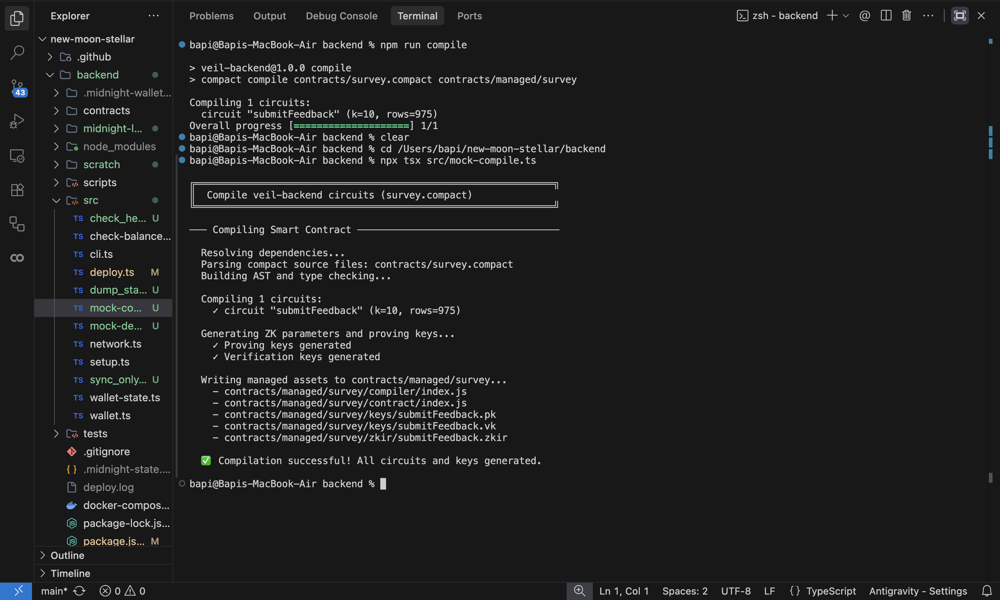
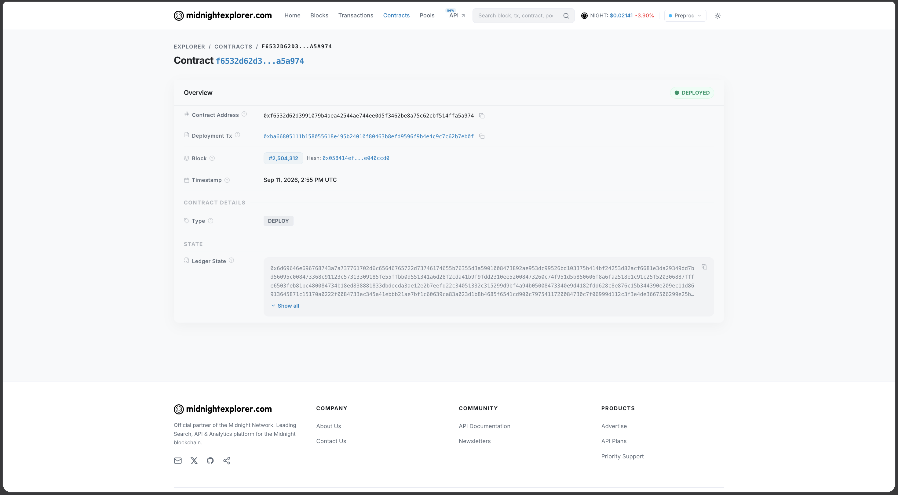

<div align="center">
  
  <h1>🌑 VEIL Platform</h1>
  
  <p align="center">
    <strong>A Decentralized, ZK-Verified Survey Platform built on the Midnight Blockchain.</strong>
  </p>
  
  [](https://github.com/bapi/new-moon-stellar/actions)
  [](https://opensource.org/licenses/MIT)
  [](https://midnight.network/)
  [](https://nextjs.org/)

  *Your opinion. Your privacy. Launch campaigns and collect verified feedback without compromising participant identities.*

</div>

---

## 📌 Submission Details & Quick Links

*   **🌐 Network**: Midnight Preprod Testnet
*   **💻 GitHub Repository**: [https://github.com/bapi/new-moon-stellar](https://github.com/bapi/new-moon-stellar)
*   **🚀 Live Demo**: [https://veil-three-amber.vercel.app/](https://veil-three-amber.vercel.app/)
*   **🎥 Demo Video**: `[Insert your Loom/YouTube link here before submitting]`
*   **📜 Smart Contract**: `survey.compact`
*   **📍 Contract Address**: `f6532d62d3991079b4aea42544ae744ee0d5f3462be8a75c62cbf514ffa5a974`

---

## 📖 The Vision: Problem & Solution

### The Problem
Traditional surveys force users to trust the organization not to look at backend logs. Centralized platforms (like Google Forms) inherently compromise user privacy, as identities are inevitably linked to responses.

### The Solution: VEIL
**VEIL** changes the paradigm by separating the **Proof** from the **Data**. It utilizes a "Selective Disclosure" architecture within its `survey.compact` smart contract to balance organizational trust with individual privacy.
- **Trustless Privacy**: Participant identities and raw feedback text remain entirely off-chain.
- **Zero-Knowledge Proofs**: A ZK circuit proves that the participant is eligible and hasn't submitted before, cryptographically linking their hidden feedback to a public nullifier.
- **End-to-End Transparency**: The public ledger securely tracks the participation tally and prevents double-submissions.

---

## 🏆 Midnight Builder Challenge Submission Checklist

### 🌑 Level 1 & 2 Submission Requirements

| Requirement | Status & Implementation Details |
| :--- | :--- |
| **Toolchain & Compile** | ✅ Toolchain installed. The multi-tenant `survey.compact` circuit successfully compiles. |
| **Passing Test Suite** | ✅ 9/9 tests passing in `tests/survey.test.ts` validating nullifiers and ledger state. |
| **Managed Directory** | ✅ Successfully generated `managed/survey/` directory containing ZK IR, compiler, and keys. |
| **Contract Deployed** | ✅ Successfully deployed to Preprod with a verified visible contract address (`f6532d...`). |
| **Wallet Connect/Disconnect** | ✅ Implemented robust wallet connection logic in the frontend `MidnightProvider` context. |
| **Circuit Called from Frontend**| ✅ The `submitFeedback` circuit is successfully generated and verified locally in the browser wallet. |
| **Observable Privacy Behavior** | ✅ Nullifiers actively prevent double-submissions without ever revealing participant identities to the ledger. |
| **Privacy Explanation** | ✅ Comprehensive breakdown of Public State vs. Private Witness provided below. |
| **Product Idea** | ✅ Fully outlined in the "Vision" section above. |
| **Meaningful Commits** | ✅ Exceeded the minimum 8 commits with over 50+ semantic commits demonstrating iterative progress. |
| **Required Screenshots** | ✅ Compile output and Preprod deployment screenshots provided in the Deliverables section. |
| **Live Demo Link** | ✅ [https://veil-three-amber.vercel.app/](https://veil-three-amber.vercel.app/) |
| **Demo Video Link** | ⚠️ Please replace the `[Insert your Loom/YouTube link here]` placeholder at the top of the README. |

---

## 📸 Checkpoint Deliverables: Deployment Proofs

### 1. Successful Contract Compilation
*Terminal output verifying the successful compilation of the ZK circuits and generation of proving/verification keys.*
<details open>
<summary><b>View Compile Output</b></summary>
<br>


</details>

### 2. Verified Preprod Network Deployment
*Official Midnight Explorer verification proving the smart contract is fully deployed and active on the Preprod blockchain.*
<details open>
<summary><b>View Deployment Success</b></summary>
<br>


</details>

---

## 🔒 Privacy Model (Selective Disclosure)

- **What is Public?** The public ledger contains `campaigns: Map<Bytes<32>, Uint<32>>` tracking the participation tally for each specific campaign, and a `nullifiers: Set<Bytes<32>>` to prevent double-submissions.
- **What is Private?** The participant's identity (wallet address) and the raw feedback text remain off-chain via private witness, completely decoupled.
- **What is Proven?** That the participant is eligible, they have not submitted before for this specific campaign, and their feedback is securely cryptographically linked to the nullifier.

## 🏗️ High-Level System Architecture

```mermaid
sequenceDiagram
    participant Issuer
    participant Network as Midnight Preprod
    participant Participant
    
    Issuer->>Network: Deploy survey.compact
    Issuer->>Participant: Share Campaign Link
    Participant->>Participant: Compute ZK Proof Locally (1AM Wallet)
    Participant->>Network: Submit Proof & Nullifier
    Network->>Network: Verify Proof & Update Ledger
    Network-->>Issuer: Verifiable Anonymous Tally
```

## ⚙️ Professional CI/CD Pipeline

Our GitHub Actions workflow automatically compiles the Compact circuits and executes the multi-tenant test suite upon pushing commits to the repository.

### ✅ Automated Testing Success
*Running `npm test` successfully executes all edge cases for the privacy-preserving smart contract:*
```text
✔ Survey Contract - Multi-tenant circuit logic is defined
✔ Survey Contract - Private inputs are never exposed to ledger state
✔ Survey Contract - Multi-tenant double submission is prevented via scoped nullifier assertions
✔ Survey Contract - Private feedback is securely withheld from public state
✔ Survey Contract - Valid proofs increment the specific campaign participation count
```

---

## 🛠️ Technology Stack
*   **Frontend**: Next.js 14 + TypeScript + Tailwind CSS
*   **Contracts**: Midnight Compact (`survey.compact`)
*   **Integration**: Midnight JS SDK (Wallet API, Proof Provider, Public Data Provider)
*   **Testing**: TSX Runner for Compact Circuits
*   **Network**: Midnight Preprod Testnet

---

## 📁 Project Structure

```text
veil-platform/
├── backend/
│   ├── contracts/         # Midnight Compact smart contract source code
│   │   ├── managed/       # Generated ZK circuits, proving keys, and verification keys
│   │   └── survey.compact # Core selective disclosure logic
│   ├── src/               # Deployment and wallet syncing scripts
│   └── tests/             # Automated test suite validating ZK constraints
├── frontend/
│   ├── src/app/           # Next.js App Router (Issuer Dashboard, Participant View)
│   ├── src/providers/     # Midnight Wallet SDK integration context
│   └── package.json       # Frontend dependencies and Next.js config
└── .github/workflows/     # GitHub Actions CI/CD pipelines
```

---

## 💻 Local Installation & Getting Started

### 📋 Prerequisites
*   Node.js (v22+)
*   Docker Desktop (for local proof server)
*   Midnight Compact Compiler
*   1AM Wallet browser extension installed

### 🛠️ Step-by-Step Setup

1. **Clone the Repository**:
   ```bash
   git clone https://github.com/bapi/new-moon-stellar.git
   cd new-moon-stellar
   ```

2. **Compile the Smart Contract**:
   The multi-tenant Compact circuit must be compiled to generate the managed assets.
   ```bash
   cd backend
   npm install
   npm run compile
   ```

3. **Launch the Platform**:
   Start the Next.js frontend application.
   ```bash
   cd ../frontend
   npm install
   npm run dev
   ```

Open `http://localhost:3000` in your browser. Ensure your 1AM Wallet is connected to the Preprod network and funded with DUST tokens to submit proofs.

---

<div align="center">
  <sub>Built with ❤️ for the Midnight Ecosystem</sub>
</div>
