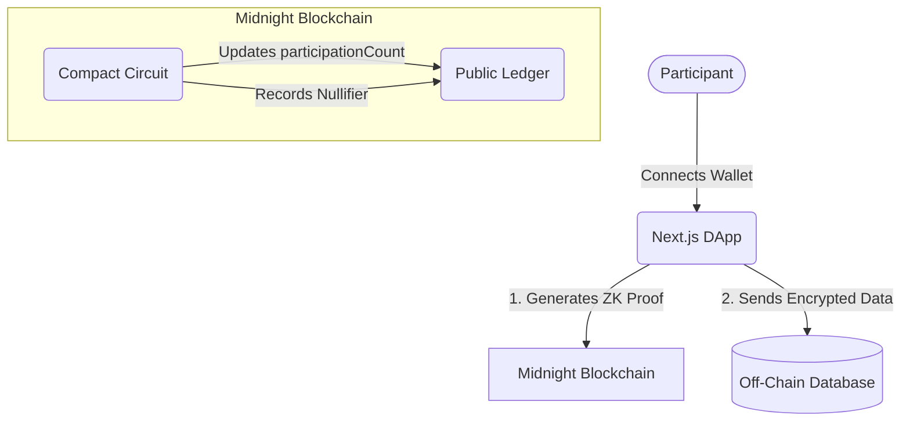

<div align="center">
  
  <h1>🌑 VEIL</h1>
  <p><strong>Your opinion. Your privacy.</strong></p>
  <p>A Privacy-Preserving Feedback Protocol built on the Midnight Blockchain.</p>

  [](https://opensource.org/licenses/MIT)
  [](https://midnight.network/)
  [](https://nextjs.org/)
  [](https://github.com/bapi/new-moon-stellar/actions/workflows/ci.yml)
</div>

<br />

## 📖 Overview

Traditional surveys force users to trust the organization not to look at backend logs. **VEIL** changes the paradigm by separating the **Proof** from the **Data**. 

VEIL utilizes **Midnight's Zero-Knowledge infrastructure** to mathematically prove that a submission is legitimate and unique, while guaranteeing that the participant's identity is completely decoupled from their response.

This project was built for the **Midnight New Moon Hackathon** and serves as a functional, end-to-end prototype of decentralized, trustless data collection.

---

## 🔒 Privacy Model (Selective Disclosure)

VEIL utilizes a "Selective Disclosure" architecture to balance organizational trust with individual privacy.

- **What is Public?** The total `participationCount` and a cryptographic `Set<Bytes<32>>` of anonymous nullifiers on the Midnight Ledger.
- **What is Private?** The participant's identity (wallet address) and the raw feedback text.
- **What is Proven?** That the participant is eligible, they have not submitted before (double-spend protection), and their feedback is securely cryptographically linked to the nullifier.

---

## 🏗️ Architecture

VEIL is divided into three distinct layers to maximize privacy and efficiency:



1. **Frontend (`/frontend`)**: A Next.js App Router application featuring an elegant, "Million Dollar" light aesthetic (Glassmorphism/Neumorphism) crafted in Vanilla CSS. It integrates directly with the **Lace Wallet Chrome Extension** via the Midnight DApp connector.
2. **Blockchain Layer (`/mn-demo/contracts`)**: A Midnight `Compact` smart contract that acts as the ZK Privacy Layer. It verifies eligibility constraints and manages the state of cryptographic nullifiers.
3. **Database Layer (`/frontend/src/app/api`)**: A Vercel Postgres integration (currently mocked for MVP) that holds the non-sensitive payload securely off-chain.

---

## 🚀 Quick Start (Local Devnet)

To run VEIL locally, you will need **Node.js (v22)**, **Docker Desktop**, and the **Midnight Compact Compiler** installed.

### 1. Start the Midnight Local Devnet
The devnet provisions a local node, indexer, and proof-server via Docker.
```bash
cd mn-demo
docker compose up -d
npm install
```

### 2. Deploy the Contract & Sync Wallet
Compile the Compact circuit and deploy it to the local devnet.
```bash
npm run setup
```

### 3. Launch the DApp
In a new terminal tab, start the Next.js frontend.
```bash
cd frontend
npm install
npm run dev
```
Open [http://localhost:3000](http://localhost:3000) in your browser. **Ensure you have the Lace Wallet for Midnight Testnet installed in your browser.**

---

## 🧪 Testing & CI/CD

VEIL ships with a comprehensive testing suite and CI/CD pipeline. 

### Smart Contract Tests
The Compact circuit is rigorously tested (`mn-demo/tests/survey.test.ts`) to ensure the Nullifier Map logic prevents double-submissions.
```bash
cd mn-demo
npm run test
```

### CI/CD Pipeline
Every push to the repository triggers `.github/workflows/ci.yml`. This pipeline automatically:
1. Compiles the `survey.compact` circuit.
2. Executes the jest test suite.
3. Builds the Next.js frontend to verify static and dynamic route integrity.

---

## 📜 Links & Documentation

- [Product Proposal (Level 3)](./PROPOSAL.md)
- [Hackathon Grading Criteria](./levels.md)

<div align="center">
  <sub>Built with ❤️ for the Midnight Ecosystem</sub>
</div>
