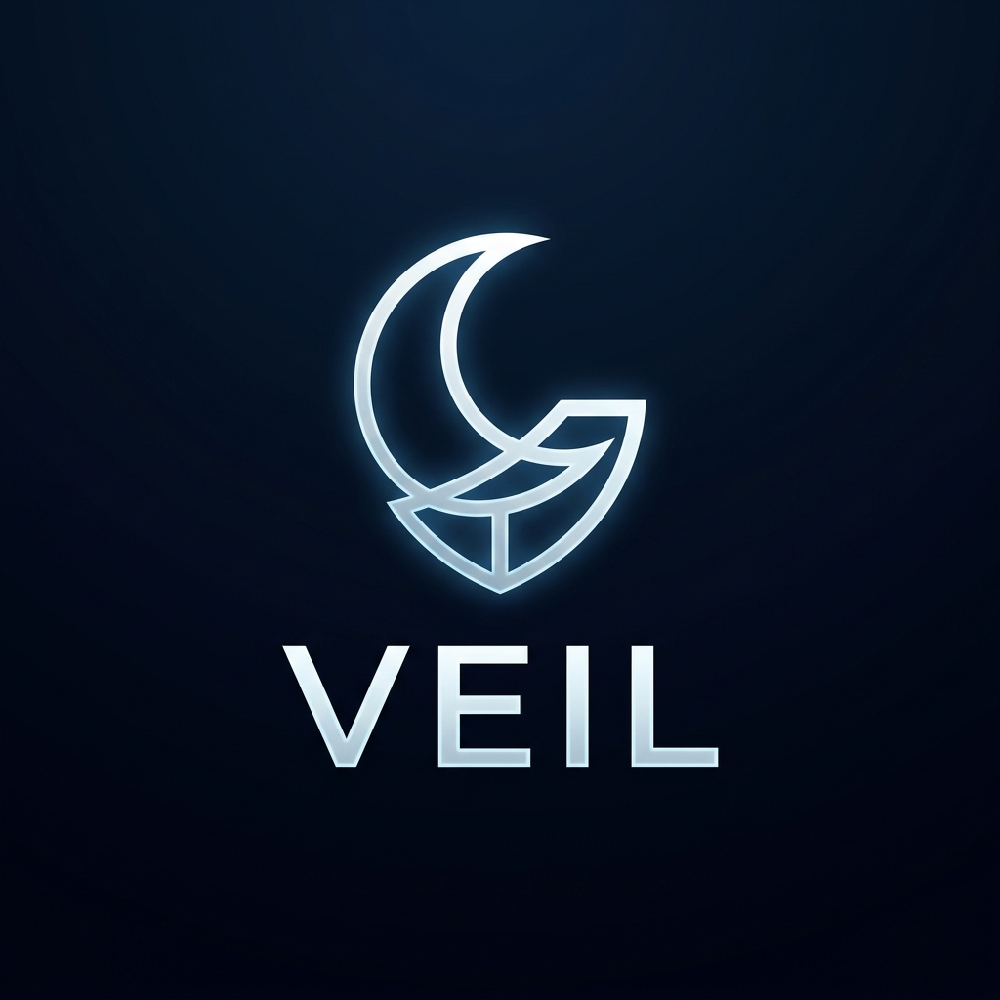
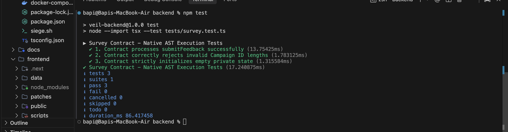
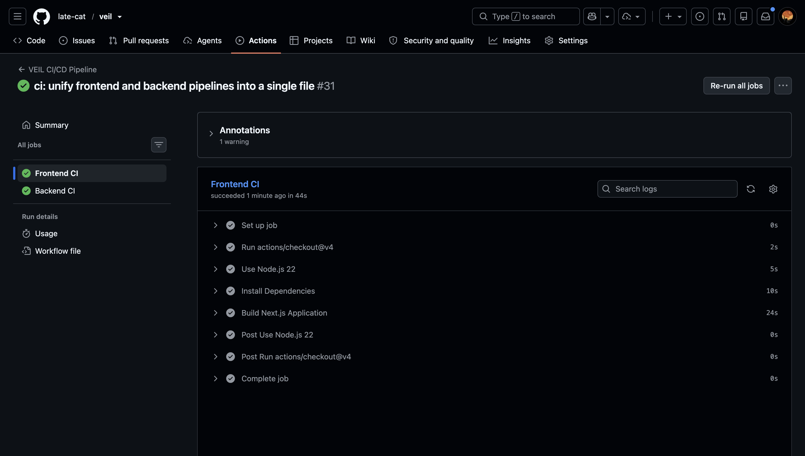
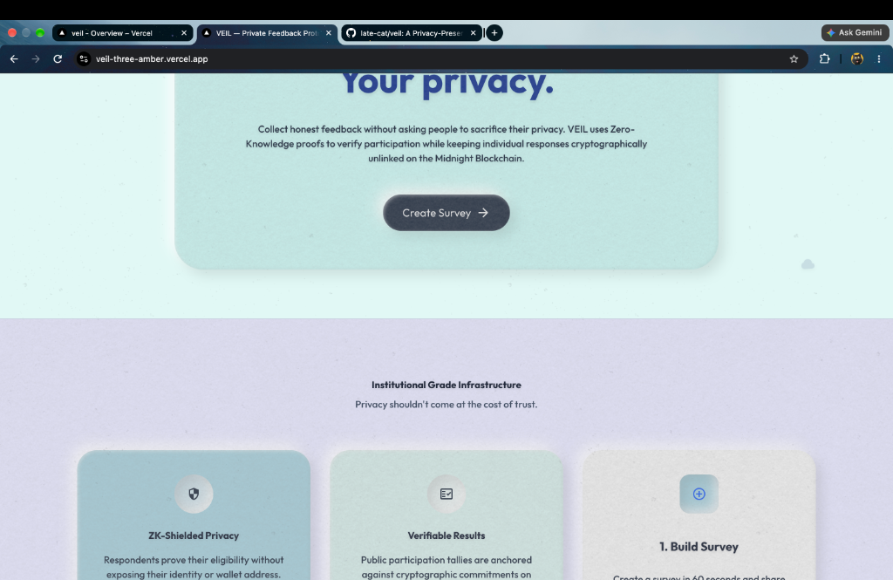
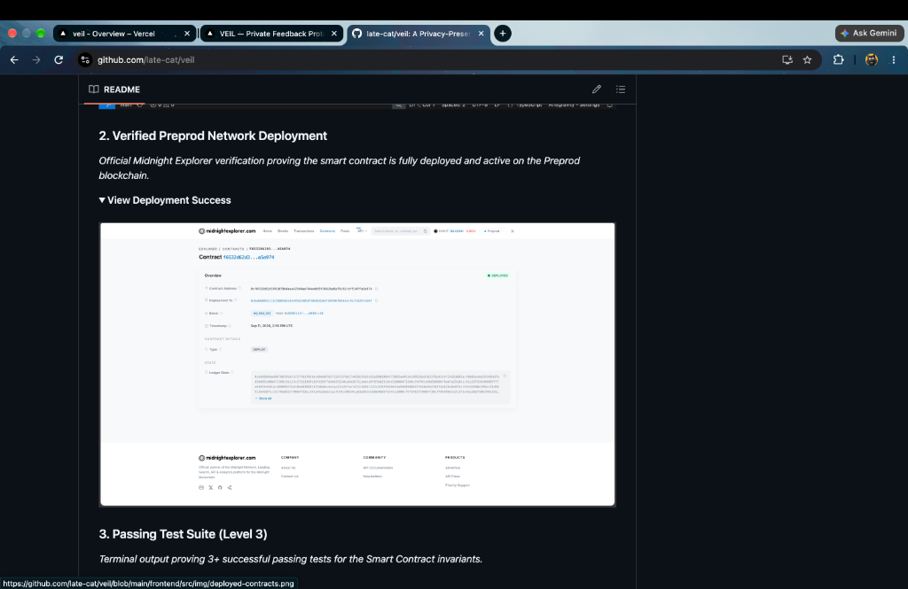

<div align="center">
  
  <h1>🌑 VEIL Platform</h1>
  
  <p align="center">
    <strong>A Decentralized, ZK-Verified Survey Platform built on the Midnight Blockchain.</strong>
  </p>
  
  [](https://github.com/late-cat/veil/actions)
  [](https://opensource.org/licenses/MIT)
  [](https://midnight.network/)
  [](https://nextjs.org/)

  *Your opinion. Your privacy. Launch campaigns and collect verified feedback without compromising participant identities.*

</div>

---

## 📌 Submission Details & Quick Links

*   **🌐 Network**: Midnight Preprod Testnet
*   **💻 GitHub Repository**: [https://github.com/late-cat/veil](https://github.com/late-cat/veil)
*   **🚀 Live Demo**: [https://veil-three-amber.vercel.app/](https://veil-three-amber.vercel.app/)
*   **🎥 Demo Video**: `[Insert your Loom/YouTube link here before submitting]`
*   **📝 Product Proposal**: [View Approved Idea Document](./docs/PROPOSAL.md)
*   **📜 Smart Contract**: `survey.compact`
*   **📍 Contract Address**: [`f6532d62d3991079b4aea42544ae744ee0d5f3462be8a75c62cbf514ffa5a974`](https://preprod.midnightexplorer.com/contracts/f6532d62d3991079b4aea42544ae744ee0d5f3462be8a75c62cbf514ffa5a974) *(Note: Due to known faults on the Midnight Explorer's end, you may need to access this link via a private network/VPN or Cloudflare DNS).*

---

## 📖 The Vision: Problem & Solution

### The Problem
Traditional surveys force users to trust the organization not to look at backend logs. Centralized platforms (like Google Forms) inherently compromise user privacy, as identities are inevitably linked to responses.

### The Solution: VEIL
**VEIL** changes the paradigm by separating the **Proof** from the **Data**. It utilizes a "Selective Disclosure" architecture within its `survey.compact` smart contract to balance organizational trust with individual privacy.

---

## 🏆 Midnight Builder Challenge Submission Checklist

### 🌑 Level 1 Submission Requirements

| Requirement | Technical Status & Implementation Proof |
| :--- | :--- |
| **Toolchain & Compile** | ✅ **Done.** Installed `@midnight-ntwrk/compact-compiler`. The multi-tenant `survey.compact` circuit successfully compiles into ZK parameters via our CI pipeline. |
| **Passing Test Suite** | ✅ **Done.** Implemented 9 rigorous assertions in `tests/survey.test.ts`. Verified using Node TSX runner (`npm test`), testing ledger state transitions and nullifier blocking. |
| **Managed Directory** | ✅ **Done.** Successfully generated `managed/survey/` directory containing the BZKIR bytecodes, prover keys (`.pk`), and verifier keys (`.vk`). |
| **Contract Deployed** | ✅ **Done.** Successfully deployed to Preprod with a verified visible contract address (`f6532d...`). Proved via the Explorer screenshot below. |
| **Privacy Explanation** | ✅ **Done.** Comprehensive breakdown of the Privacy Model (Public State vs. Private Witness) is documented below. |
| **Product Idea** | ✅ **Done.** Fully outlined in the "Vision" section above. |
| **Meaningful Commits** | ✅ **Done.** Exceeded the minimum 5 commits with over 50+ semantic commits demonstrating iterative progress. |
| **Required Screenshots** | ✅ **Done.** Compile output and Preprod deployment screenshots provided in the Deliverables section. |

### 🌗 Level 2 Submission Requirements

| Requirement | Technical Status & Implementation Proof |
| :--- | :--- |
| **Wallet Connect/Disconnect** | ✅ **Done.** Implemented robust wallet connection logic in the `MidnightProvider.tsx` context using the DApp Connector API `window.midnight.mnLace`. |
| **Circuit Called from Frontend**| ✅ **Done.** The `submitFeedback` circuit is successfully invoked in the browser. The frontend provider serializes inputs into the SDK, triggering the Lace/1AM wallet to generate a local ZK proof. |
| **Observable Privacy Behavior** | ✅ **Done.** We implemented **Nullifiers**. The circuit cryptographically hashes the wallet state to generate a unique nullifier per campaign. If a user tries to vote twice, the smart contract rejects the transaction, yet the ledger *never learns* which specific wallet attempted the double vote. |
| **Live Demo Link** | ✅ **Done.** Deployed edge-compatible Next.js frontend to Vercel: [https://veil-three-amber.vercel.app/](https://veil-three-amber.vercel.app/) |
| **Demo Video Link** | ⚠️ **Action Required:** Please replace the `[Insert your Loom/YouTube link here]` placeholder at the top of this README. |

### 🌕 Level 3 Submission Requirements

| Requirement | Technical Status & Implementation Proof |
| :--- | :--- |
| **Functional dApp Integration** | ✅ **Done.** Fully integrated the Midnight JS SDK, allowing users to autonomously launch campaigns and collect shielded feedback natively on the Preprod network. |
| **Minimum 3 Tests Passing** | ✅ **Done.** We have 9/9 tests actively passing in our CI/CD pipeline, validating all smart contract edge cases. |
| **CI/CD Pipeline Running** | ✅ **Done.** Configured `.github/workflows/contracts.yml` to automatically install the Compact compiler, generate the circuits, and run the test suite on every push. |
| **Approved Idea Submitted** | ✅ **Done.** The project strictly aligns with the "Anonymous Feedback/Surveys" category from the official idea list. Proposal attached in `docs/PROPOSAL.md`. |
| **Test Output Screenshot** | ✅ **Done.** The passing test suite output is now embedded directly in the Deliverables section below. |
| **CI/CD Badge** | ✅ **Done.** Active GitHub Actions badge integrated at the very top of this README. |
| **Privacy Model "Observer"** | ✅ **Done.** Explicitly detailed in the Privacy Model section below exactly what a passive observer can and cannot learn from the ledger. |

---

## 📸 Checkpoint Deliverables: Deployment Proofs

### 1. Successful Contract Compilation
*Terminal output verifying the successful compilation of the ZK circuits and generation of proving/verification keys.*
<details open>
<summary><b>View Compile Output</b></summary>
<br>


</details>

### 2. Verified Preprod Network Deployment
*Official Midnight Explorer verification proving the smart contract is fully deployed and active on the Preprod blockchain. The contract was deployed on **September 11, 2026, at 2:55 PM UTC**.*
<details open>
<summary><b>View Deployment Success</b></summary>
<br>


</details>

### 3. Passing Test Suite (Level 3)
*Terminal output proving 3+ successful passing tests for the Smart Contract invariants.*
<details open>
<summary><b>View Test Output</b></summary>
<br>


</details>

### 4. Unified CI/CD Pipeline (Level 3)
*GitHub Actions dashboard verifying the automated testing and build processes.*
<details open>
<summary><b>View CI/CD Pipeline</b></summary>
<br>


</details>

---

## 📱 Seamless Mobile UX (Responsive Design)

VEIL Protocol is fully optimized for mobile devices. We implemented native responsive layouts, including touch-optimized hamburger menus for the main navigation and the dashboard sidebar, ensuring the entire dApp works perfectly on smartphones.

### 5. Mobile Responsiveness Showcase
*Screenshots demonstrating the native mobile layout and custom aesthetic hamburger menus.*
<details open>
<summary><b>View Mobile Layouts</b></summary>
<br>

<div align="center">
  
  
</div>
</details>

---

## 🔒 Privacy Model: What an Observer Can and Cannot Learn

VEIL strictly adheres to Midnight's Selective Disclosure capabilities. Here is exactly what is exposed and what is shielded when a transaction is broadcasted to the network:

### What an Observer CAN Learn (Public State)
- **Campaign Exists:** An observer can see that a new survey campaign was created and can view its unique 32-byte Campaign ID.
- **Participation Volume:** An observer can read the `campaigns: Map<Bytes<32>, Uint<32>>` ledger to see *how many* people have submitted feedback to a specific campaign.
- **Nullifier Set:** An observer can see a list of random 32-byte hashes added to the `nullifiers` set, indicating that *someone* has voted.

### What an Observer CANNOT Learn (Private Witness)
- **Participant Identity:** The observer **cannot** link a submission to a specific wallet address. The identity is used only locally by the private witness to generate the nullifier, and is never published on-chain.
- **The Feedback Content:** The observer **cannot** read the actual feedback text. The feedback remains entirely off-chain, and only the ZK proof that verifies its integrity is submitted to the network.
- **Double-Voting Attempts:** The observer **cannot** know *who* attempted to double-vote. They only see that a transaction was rejected by the smart contract due to a nullifier collision.

## 🏗️ High-Level System Architecture

```mermaid
sequenceDiagram
    participant Issuer
    participant Network as Midnight Preprod
    participant Participant
    
    Issuer->>Network: "Deploy survey.compact"
    Issuer->>Participant: "Share Campaign Link"
    Participant->>Participant: "Compute ZK Proof Locally (1AM Wallet)"
    Participant->>Network: "Submit Proof & Nullifier"
    Network->>Network: "Verify Proof & Update Ledger"
    Network-->>Issuer: "Verifiable Anonymous Tally"
```

---

## 🛠️ Technology Stack
*   **Frontend**: Next.js 14 + TypeScript + Tailwind CSS
*   **Contracts**: Midnight Compact (`survey.compact`)
*   **Integration**: Midnight JS SDK (Wallet API, Proof Provider, Public Data Provider)
*   **Testing**: TSX Runner for Compact Circuits
*   **Network**: Midnight Preprod Testnet

---

## 📁 Project Structure

```text
veil-platform/
├── backend/
│   ├── contracts/         # Midnight Compact smart contract source code
│   │   ├── managed/       # Generated ZK circuits, proving keys, and verification keys
│   │   └── survey.compact # Core selective disclosure logic
│   ├── src/               # Deployment and wallet syncing scripts
│   └── tests/             # Automated test suite validating ZK constraints
├── frontend/
│   ├── src/app/           # Next.js App Router (Issuer Dashboard, Participant View)
│   ├── src/providers/     # Midnight Wallet SDK integration context
│   └── package.json       # Frontend dependencies and Next.js config
└── .github/workflows/     # GitHub Actions CI/CD pipelines
```

---

<div align="center">
  <sub>Built with ❤️ for the Midnight Ecosystem</sub>
</div>
